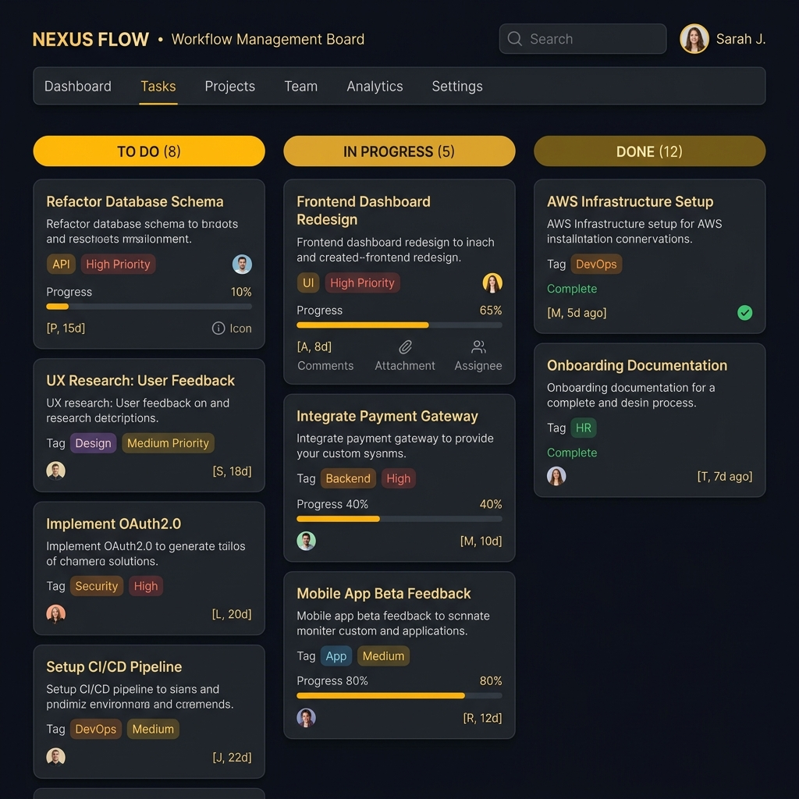

# 📋 CCGworkflow - Deep Teal Kanban Project Board

A professional team project board styled with a **Deep Teal & Charcoal** minimal layout, offering clean pipeline management.

## ✨ Humanized & Localized Features
- 📝 **Fred's Real Task Board** — Cards populated with Fred's actual sprint items ("Integrate M-Pesa STK", "Update Nyakach TVC files").
- 👥 **Team Initials Badges** — Task assignments use initial badges ("FO" for Fred, "AM" for Mentor) to replicate a real working team.
- 🛠️ **Click-to-Move Pipelines** — Interactive buttons move cards seamlessly between "To Do", "In Progress", and "Done" columns.

## 🛠️ Tech Stack
- **Frontend:** React, TypeScript, HTML5, CSS3
- **Typography:** Outfit & Source Sans Pro
